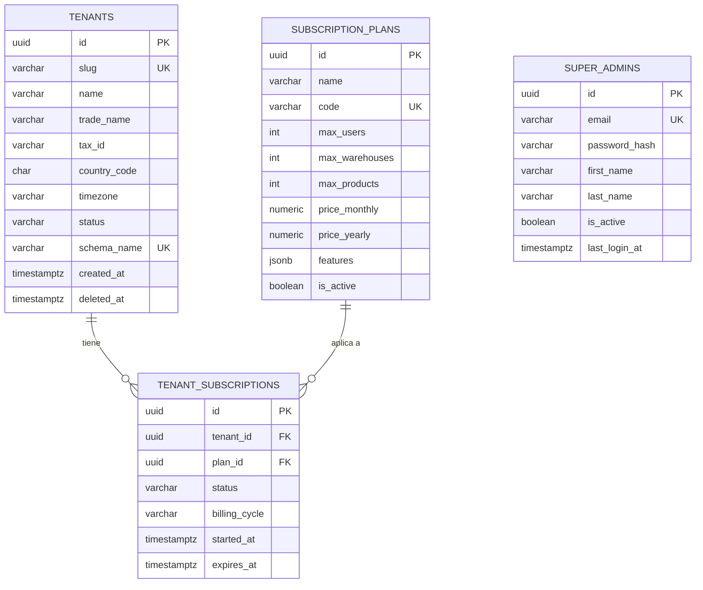
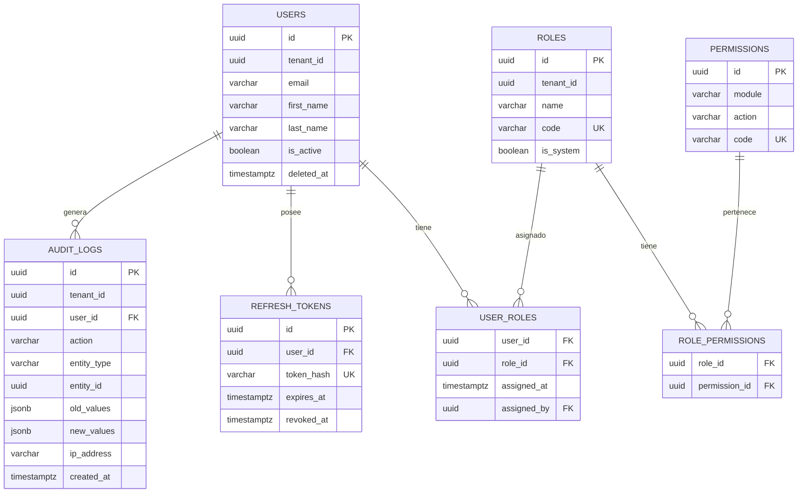
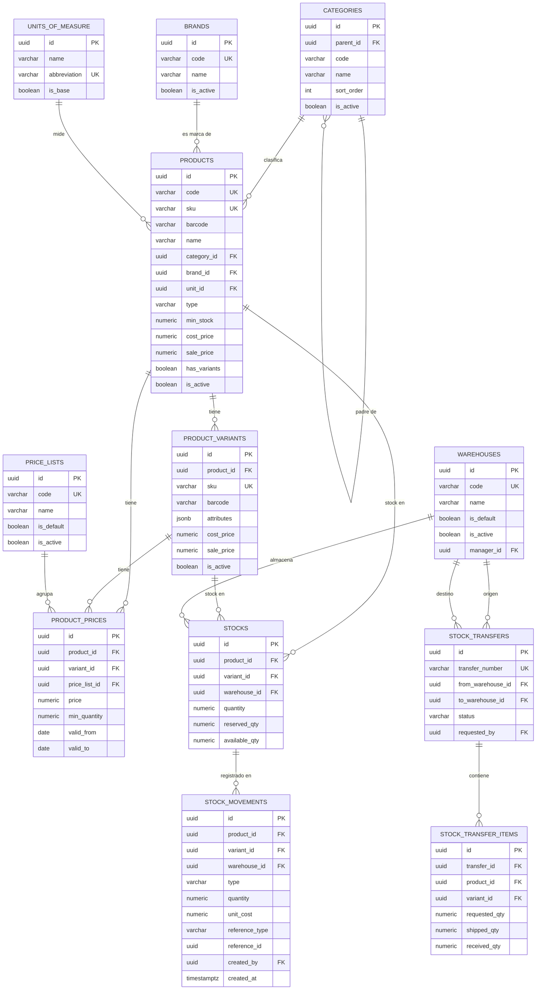
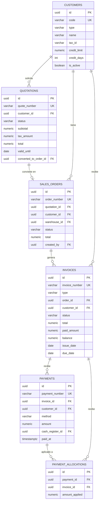
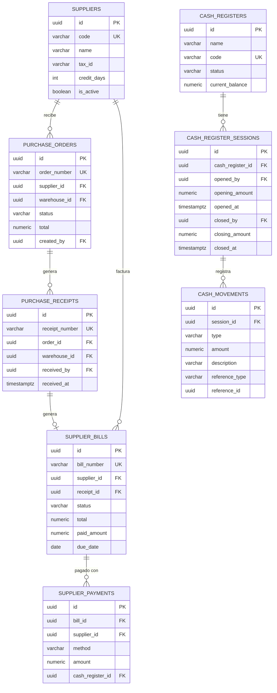

# Diseño de Base de Datos — Sistema SaaS Inventario y Ventas
## Documento DBA Senior

**Versión:** 1.0.0  
**Fecha:** 2026-06-20  
**Motor:** PostgreSQL 15+  
**Estrategia Multi-Tenant:** Schema-per-Tenant + tenant_id defensa en profundidad

---

## Tabla de Contenidos

1. [Decisiones de Diseño Críticas](#1-decisiones-de-diseño-críticas)
2. [Estrategia Multi-Tenant](#2-estrategia-multi-tenant)
3. [Convenciones Globales](#3-convenciones-globales)
4. [Diagrama ER](#4-diagrama-er)
5. [Diccionario de Datos — Schema Public](#5-diccionario-de-datos--schema-public)
6. [Diccionario de Datos — Schema Tenant](#6-diccionario-de-datos--schema-tenant)
7. [Estrategia de Índices](#7-estrategia-de-índices)
8. [Estrategia de Migraciones](#8-estrategia-de-migraciones)
9. [Estrategia de Versionado de Schema](#9-estrategia-de-versionado-de-schema)
10. [Estrategia de Backups](#10-estrategia-de-backups)

---

# 1. Decisiones de Diseño Críticas

## 1.1 UUID v4 como PK — No SERIAL/BIGINT

**Decisión:** Todos los IDs son `UUID NOT NULL DEFAULT gen_random_uuid()`.

**Por qué no SERIAL/BIGINT:**
- SERIAL es predecible — un atacante puede enumerar registros por ID
- SERIAL no funciona bien en arquitecturas distribuidas o con sharding futuro
- UUID permite generar IDs en el cliente sin round-trip al servidor (útil para operaciones offline/batch)
- En schema-per-tenant, los SERIAL reinician por schema — mezcla de datos en reporting da colisiones

**Trade-off aceptado:** UUIDs ocupan 16 bytes vs 8 de BIGINT, degradan levemente la locality de B-tree indexes. Mitigado con índices parciales y CLUSTER periódico en tablas críticas.

**Nota sobre UUID v7:** PostgreSQL 17 incluye `gen_uuid_v7()` nativo. Con PG 15/16, instalar la extensión `pg_uuidv7` o generar UUIDv7 en la aplicación y pasarlo en el INSERT. Los UUIDv7 son time-ordered, eliminan el problema de page splits aleatorios en B-tree. **Se recomienda migrar a UUIDv7 cuando PG17 sea el estándar en el equipo.**

## 1.2 NUMERIC(15,4) para Dinero — Nunca FLOAT

**Decisión:** Todo valor monetario usa `NUMERIC(15,4)`.

`FLOAT` y `DOUBLE PRECISION` son representaciones de punto flotante IEEE 754 — tienen errores de redondeo. `0.1 + 0.2` en FLOAT no es `0.3`. En un sistema financiero esto es inaceptable. `NUMERIC` es exacto por definición en PostgreSQL.

`NUMERIC(15,4)`:
- 15 dígitos totales significativos
- 4 decimales (suficiente para monedas con 4 decimales como KWD)
- Rango hasta 99,999,999,999.9999 — más que suficiente para facturación B2B

Porcentajes (impuestos, descuentos): `NUMERIC(7,4)` — hasta 999.9999%

## 1.3 TIMESTAMPTZ — Nunca TIMESTAMP

**Decisión:** Todos los campos de fecha/hora usan `TIMESTAMPTZ` (timestamp with time zone).

`TIMESTAMP` almacena la hora local del servidor. Si el servidor cambia de zona horaria o se migra, todos los datos históricos quedan descontextualizados. `TIMESTAMPTZ` almacena en UTC internamente y convierte a la zona horaria del cliente en la presentación.

El campo `timezone` en la tabla `tenants` controla la conversión para reportes por tenant.

## 1.4 VARCHAR con Límites Explícitos — No TEXT para todo

**Decisión:** Campos cortos usan `VARCHAR(n)` con límite. Texto libre usa `TEXT`.

`TEXT` y `VARCHAR` en PostgreSQL tienen el mismo performance interno — no hay diferencia de storage. La diferencia es semántica y de validación: `VARCHAR(50)` rechaza valores más largos a nivel de BD, sin necesidad de validación en la aplicación. Para campos donde el límite es incierto (notas, descripciones), se usa `TEXT`.

## 1.5 CHECK Constraints en lugar de ENUM Types

**Decisión:** Los valores de tipo enumerado se validan con `CHECK (campo IN (...))`, no con tipos ENUM de PostgreSQL.

Los tipos ENUM de PostgreSQL son difíciles de alterar en producción. Agregar un valor requiere `ALTER TYPE` que en versiones anteriores de PG reescribía la tabla. Con `CHECK (... IN (...))`, modificar valores aceptados es un `ALTER TABLE ... DROP CONSTRAINT / ADD CONSTRAINT` que no bloquea la tabla.

## 1.6 Soft Delete con deleted_at

**Decisión:** Todas las entidades de negocio usan `deleted_at TIMESTAMPTZ` para eliminación lógica.

Reglas:
- `deleted_at IS NULL` → registro activo
- `deleted_at IS NOT NULL` → registro eliminado lógicamente
- Nunca ejecutar `DELETE` físico en entidades de negocio desde la aplicación
- Índices únicos condicionales: `WHERE deleted_at IS NULL`
- TypeORM: usar `@DeleteDateColumn()` y `.softDelete()`

Excepción: `audit_logs`, `stock_movements` y tablas de log son inmutables. Sin soft delete ni hard delete desde aplicación.

## 1.7 tenant_id en Schema-per-Tenant: Defensa en Profundidad

**Decisión:** Se agrega `tenant_id UUID NOT NULL` en todas las tablas del schema del tenant, aunque el aislamiento principal es por schema.

**Justificación técnica de por qué NO es redundante:**

1. **Defense in depth**: Si por un bug en PgBouncer/middleware el `search_path` apunta al schema equivocado, el `tenant_id` funciona como segunda capa de verificación mediante Row Level Security
2. **Cross-tenant reporting**: El Super Admin puede hacer queries `UNION ALL` entre schemas para reportes globales, y el `tenant_id` permite filtrar/agrupar sin ambigüedad
3. **Replicación y archivado**: Al replicar registros fuera de su schema (archivado, data warehouse), el `tenant_id` mantiene la trazabilidad
4. **Migración futura**: Si en el futuro se decide migrar de schema-per-tenant a shared-schema (por ejemplo al superar 5,000 tenants y el overhead de schemas PostgreSQL se vuelve problema), el `tenant_id` ya está en todas las tablas

**Implementación:**

```sql
-- La aplicación ejecuta esto en cada conexión antes de cualquier query:
SET app.current_tenant_id = 'uuid-del-tenant';
SET search_path TO tenant_slug, public;

-- En cada tabla del tenant:
tenant_id UUID NOT NULL DEFAULT current_setting('app.current_tenant_id')::UUID
```

El `DEFAULT` automático hace que ningún INSERT de aplicación necesite especificar `tenant_id` explícitamente — se toma del session variable. Es transparente para el ORM.

## 1.8 Row Level Security como Tercera Capa

Se implementa RLS en tablas críticas del tenant como tercera capa de seguridad:

```sql
ALTER TABLE invoices ENABLE ROW LEVEL SECURITY;

CREATE POLICY tenant_isolation ON invoices
  USING (tenant_id = current_setting('app.current_tenant_id')::UUID);
```

Con esto, incluso si el middleware falla y el `search_path` es incorrecto, RLS bloquea el acceso a datos de otros tenants.

## 1.9 Numeradores de Documentos con SEQUENCE

**Decisión:** Los números correlativos de documentos (facturas, órdenes, etc.) usan SEQUENCE de PostgreSQL, no auto-increment en la aplicación.

```sql
-- Por cada tipo de documento, por tenant:
CREATE SEQUENCE invoice_seq START 1 INCREMENT 1 NO CYCLE;
-- Uso: nextval('invoice_seq') -> 1, 2, 3...
-- Formateado: 'FAC-' || LPAD(nextval('invoice_seq')::TEXT, 8, '0')
```

Los SEQUENCE de PostgreSQL son seguros ante concurrencia, no producen gaps bajo condiciones normales, y son por schema (cada tenant tiene sus propios). No hay colisión entre tenants.

---

# 2. Estrategia Multi-Tenant

## 2.1 Arquitectura de Schemas

```
PostgreSQL Instance
│
├── Schema: public                    (GLOBAL — 1 instancia)
│   ├── tenants
│   ├── subscription_plans
│   ├── tenant_subscriptions
│   └── super_admins
│
├── Schema: tenant_acme               (TENANT "Acme Corp")
│   ├── users, roles, permissions
│   ├── products, categories, brands
│   ├── sales_orders, invoices
│   └── ... (55+ tablas)
│
├── Schema: tenant_globex             (TENANT "Globex Inc")
│   └── ... (mismo set de tablas, datos completamente separados)
│
└── Schema: tenant_N
    └── ...
```

## 2.2 Flujo de Request

```
HTTP Request
→ TenantMiddleware (NestJS)
  → Extrae slug/tenant_id del JWT
  → Valida que tenant existe y status = 'active' en public.tenants
  → Obtiene schema_name del tenant
→ TypeORM Connection
  → SET search_path TO {schema_name}, public
  → SET app.current_tenant_id = '{tenant_id}'
→ Query ejecutada en el schema correcto
→ RLS verifica tenant_id en cada fila
```

## 2.3 Creación de Nuevo Tenant

```sql
-- 1. Insertar en public.tenants
INSERT INTO public.tenants (id, slug, name, schema_name, ...) VALUES (...);

-- 2. Crear schema
SELECT create_tenant_schema('tenant_acme', tenant_id);
-- Esta función:
--   a. CREATE SCHEMA tenant_acme
--   b. SET search_path TO tenant_acme
--   c. Ejecuta todo el DDL de tablas, índices, constraints
--   d. Habilita RLS en tablas críticas
--   e. Seed de datos base (roles, permisos, monedas, config)

-- 3. Crear usuario admin del tenant
INSERT INTO tenant_acme.users (...) VALUES (...);
```

---

# 3. Convenciones Globales

| Elemento | Convención |
|---|---|
| Nombres de tablas | `snake_case`, plural (ej: `sales_orders`) |
| Nombres de columnas | `snake_case` (ej: `created_at`) |
| PK | `id UUID NOT NULL DEFAULT gen_random_uuid()` |
| PK constraint | `CONSTRAINT pk_{tabla} PRIMARY KEY (id)` |
| FK constraint | `CONSTRAINT fk_{tabla}_{campo} FOREIGN KEY ({campo}) REFERENCES {ref_tabla}({ref_campo})` |
| UNIQUE constraint | `CONSTRAINT uq_{tabla}_{campo(s)} UNIQUE (...)` |
| CHECK constraint | `CONSTRAINT chk_{tabla}_{descripcion} CHECK (...)` |
| Campos monetarios | `NUMERIC(15,4) NOT NULL DEFAULT 0` |
| Campos porcentaje | `NUMERIC(7,4) NOT NULL DEFAULT 0` |
| Timestamps | `TIMESTAMPTZ NOT NULL DEFAULT NOW()` |
| Campos opcionales | Explícitamente indicados con comentario `-- opcional` |
| Índices | `idx_{tabla}_{campo(s)}` |
| Índices únicos | `uidx_{tabla}_{campo(s)}` |
| Soft delete | `deleted_at TIMESTAMPTZ` (NULL = activo, NOT NULL = eliminado) |
| Auditoría base | `created_at`, `updated_at`, `deleted_at` en todas las entidades |
| Auditoría extendida | `created_by UUID`, `updated_by UUID` en documentos |

---

# 4. Diagrama ER

## 4.1 Schema Public



## 4.2 Schema Tenant — Core



## 4.3 Schema Tenant — Catálogo e Inventario



## 4.4 Schema Tenant — Ventas



## 4.5 Schema Tenant — Compras y Finanzas



---

# 5. Diccionario de Datos — Schema Public

## 5.1 `public.tenants`

**Propósito:** Registro maestro de todas las empresas suscritas a la plataforma. Es la tabla raíz de todo el sistema multi-tenant.

| Columna | Tipo | Nulo | Default | Descripción |
|---|---|---|---|---|
| `id` | UUID | NO | gen_random_uuid() | PK — Identificador único del tenant |
| `slug` | VARCHAR(100) | NO | — | Identificador URL-safe único (ej: `acme-corp`) |
| `name` | VARCHAR(255) | NO | — | Razón social / nombre legal |
| `trade_name` | VARCHAR(255) | SÍ | — | Nombre comercial (opcional) |
| `tax_id` | VARCHAR(50) | SÍ | — | RUC/NIT/RFC/CUIT según país |
| `country_code` | CHAR(2) | NO | — | ISO 3166-1 alpha-2 (ej: PE, CO, MX) |
| `timezone` | VARCHAR(50) | NO | 'UTC' | IANA timezone (ej: America/Lima) |
| `status` | VARCHAR(20) | NO | 'trial' | `trial`, `active`, `suspended`, `cancelled` |
| `schema_name` | VARCHAR(100) | NO | — | Nombre del schema PG (ej: `tenant_acme_corp`) |
| `contact_email` | VARCHAR(255) | SÍ | — | Email de contacto principal |
| `contact_phone` | VARCHAR(30) | SÍ | — | Teléfono de contacto |
| `logo_url` | VARCHAR(500) | SÍ | — | URL del logo de la empresa |
| `max_users` | INT | NO | 5 | Límite de usuarios (sobreescribe plan) |
| `trial_ends_at` | TIMESTAMPTZ | SÍ | — | Fin del período trial |
| `created_at` | TIMESTAMPTZ | NO | NOW() | Fecha de registro |
| `updated_at` | TIMESTAMPTZ | NO | NOW() | Última modificación |
| `deleted_at` | TIMESTAMPTZ | SÍ | — | Soft delete |

**Índices:** PK(id), UQ(slug), UQ(schema_name), IDX(status), IDX(created_at)  
**Checks:** `status IN ('trial','active','suspended','cancelled')`  
**Triggers:** `update_updated_at` en UPDATE

---

## 5.2 `public.subscription_plans`

**Propósito:** Catálogo de planes de suscripción disponibles en la plataforma.

| Columna | Tipo | Nulo | Default | Descripción |
|---|---|---|---|---|
| `id` | UUID | NO | gen_random_uuid() | PK |
| `name` | VARCHAR(100) | NO | — | Nombre visible (Basic, Pro, Enterprise) |
| `code` | VARCHAR(50) | NO | — | Código único (BASIC, PRO, ENTERPRISE) |
| `description` | TEXT | SÍ | — | Descripción del plan |
| `max_users` | INT | NO | — | Límite de usuarios (-1 = ilimitado) |
| `max_warehouses` | INT | NO | — | Límite de almacenes |
| `max_products` | INT | NO | — | Límite de productos |
| `max_storage_gb` | NUMERIC(8,2) | NO | 5 | Almacenamiento en GB |
| `price_monthly` | NUMERIC(10,2) | NO | 0 | Precio mensual en USD |
| `price_yearly` | NUMERIC(10,2) | NO | 0 | Precio anual en USD |
| `features` | JSONB | SÍ | — | Features habilitadas: `{"reports": true, "api": false}` |
| `is_active` | BOOLEAN | NO | TRUE | Si el plan está disponible para nuevas suscripciones |
| `sort_order` | INT | NO | 0 | Orden de presentación |
| `created_at` | TIMESTAMPTZ | NO | NOW() | — |
| `updated_at` | TIMESTAMPTZ | NO | NOW() | — |

**Índices:** PK(id), UQ(code), IDX(is_active)

---

## 5.3 `public.tenant_subscriptions`

**Propósito:** Relación activa entre un tenant y su plan de suscripción. Permite cambios de plan e historial.

| Columna | Tipo | Nulo | Default | Descripción |
|---|---|---|---|---|
| `id` | UUID | NO | gen_random_uuid() | PK |
| `tenant_id` | UUID | NO | — | FK → tenants.id |
| `plan_id` | UUID | NO | — | FK → subscription_plans.id |
| `status` | VARCHAR(20) | NO | 'active' | `active`, `past_due`, `cancelled`, `expired` |
| `billing_cycle` | VARCHAR(10) | NO | 'monthly' | `monthly`, `yearly` |
| `amount` | NUMERIC(10,2) | NO | — | Monto real cobrado (puede diferir del plan) |
| `currency_code` | CHAR(3) | NO | 'USD' | ISO 4217 |
| `started_at` | TIMESTAMPTZ | NO | NOW() | Inicio de la suscripción |
| `expires_at` | TIMESTAMPTZ | SÍ | — | NULL = no expira (plan vitalicio) |
| `cancelled_at` | TIMESTAMPTZ | SÍ | — | Fecha de cancelación |
| `cancel_reason` | TEXT | SÍ | — | Razón de cancelación |
| `external_ref` | VARCHAR(100) | SÍ | — | ID en pasarela de pagos (Stripe, etc.) |
| `created_at` | TIMESTAMPTZ | NO | NOW() | — |
| `updated_at` | TIMESTAMPTZ | NO | NOW() | — |

**Índices:** PK(id), IDX(tenant_id, status), IDX(expires_at)  
**Checks:** `status IN ('active','past_due','cancelled','expired')`  
**FK:** tenant_id → tenants.id ON DELETE RESTRICT, plan_id → subscription_plans.id ON DELETE RESTRICT

---

## 5.4 `public.super_admins`

**Propósito:** Administradores de la plataforma SaaS (no son usuarios de ningún tenant específico).

| Columna | Tipo | Nulo | Default | Descripción |
|---|---|---|---|---|
| `id` | UUID | NO | gen_random_uuid() | PK |
| `email` | VARCHAR(255) | NO | — | Email único |
| `password_hash` | VARCHAR(255) | NO | — | bcrypt ($2b$12$...) |
| `first_name` | VARCHAR(100) | NO | — | — |
| `last_name` | VARCHAR(100) | NO | — | — |
| `is_active` | BOOLEAN | NO | TRUE | — |
| `mfa_secret` | VARCHAR(100) | SÍ | — | TOTP secret (2FA) |
| `mfa_enabled` | BOOLEAN | NO | FALSE | — |
| `last_login_at` | TIMESTAMPTZ | SÍ | — | — |
| `last_login_ip` | VARCHAR(45) | SÍ | — | — |
| `created_at` | TIMESTAMPTZ | NO | NOW() | — |
| `updated_at` | TIMESTAMPTZ | NO | NOW() | — |
| `deleted_at` | TIMESTAMPTZ | SÍ | — | — |

**Índices:** PK(id), UQ(email WHERE deleted_at IS NULL)  
**Nota de seguridad:** Los super_admins NUNCA deben tener un token activo de un tenant específico. Sus operaciones se loguean en una tabla separada `public.super_admin_audit_logs`.

---

# 6. Diccionario de Datos — Schema Tenant

> Todas las tablas siguientes existen en el schema de cada tenant (`tenant_{slug}`). Todas incluyen `tenant_id UUID NOT NULL` como defensa en profundidad. Cuando no se indica otro valor, `tenant_id` tiene `DEFAULT current_setting('app.current_tenant_id')::UUID`.

---

## 6.1 AUTH & USUARIOS

### `users`

**Propósito:** Usuarios con acceso al sistema del tenant.

| Columna | Tipo | Nulo | Default | Descripción |
|---|---|---|---|---|
| `id` | UUID | NO | gen_random_uuid() | PK |
| `tenant_id` | UUID | NO | session var | FK implícita al tenant |
| `email` | VARCHAR(255) | NO | — | Email de acceso |
| `password_hash` | VARCHAR(255) | NO | — | bcrypt hash |
| `first_name` | VARCHAR(100) | NO | — | — |
| `last_name` | VARCHAR(100) | NO | — | — |
| `phone` | VARCHAR(30) | SÍ | — | — |
| `avatar_url` | VARCHAR(500) | SÍ | — | — |
| `is_active` | BOOLEAN | NO | TRUE | — |
| `email_verified_at` | TIMESTAMPTZ | SÍ | — | NULL = no verificado |
| `last_login_at` | TIMESTAMPTZ | SÍ | — | — |
| `login_attempts` | SMALLINT | NO | 0 | Intentos fallidos consecutivos |
| `locked_until` | TIMESTAMPTZ | SÍ | — | Bloqueo temporal por intentos |
| `created_at` | TIMESTAMPTZ | NO | NOW() | — |
| `updated_at` | TIMESTAMPTZ | NO | NOW() | — |
| `deleted_at` | TIMESTAMPTZ | SÍ | — | Soft delete |
| `created_by` | UUID | SÍ | — | FK → users.id |

**Índices:** PK(id), UQ(email, tenant_id WHERE deleted_at IS NULL), IDX(is_active), IDX(tenant_id)  
**Checks:** email formato válido, login_attempts >= 0

---

### `roles`

**Propósito:** Roles de acceso configurables por tenant. Roles del sistema (`is_system=true`) no son editables.

| Columna | Tipo | Nulo | Default | Descripción |
|---|---|---|---|---|
| `id` | UUID | NO | gen_random_uuid() | PK |
| `tenant_id` | UUID | NO | session var | — |
| `name` | VARCHAR(100) | NO | — | Nombre visible (Vendedor, Almacenista) |
| `code` | VARCHAR(50) | NO | — | Código único (SALES, WAREHOUSE, ADMIN) |
| `description` | TEXT | SÍ | — | — |
| `is_system` | BOOLEAN | NO | FALSE | Roles de sistema: no editables ni eliminables |
| `is_active` | BOOLEAN | NO | TRUE | — |
| `created_at` | TIMESTAMPTZ | NO | NOW() | — |
| `updated_at` | TIMESTAMPTZ | NO | NOW() | — |

**Índices:** PK(id), UQ(code, tenant_id)

---

### `permissions`

**Propósito:** Catálogo de permisos granulares del sistema. Es un catálogo fijo — se inserta en el seed y no cambia por acciones del tenant.

| Columna | Tipo | Nulo | Default | Descripción |
|---|---|---|---|---|
| `id` | UUID | NO | gen_random_uuid() | PK |
| `module` | VARCHAR(100) | NO | — | Módulo (products, sales_orders, reports) |
| `action` | VARCHAR(50) | NO | — | Acción (create, read, update, delete, export, approve) |
| `resource` | VARCHAR(100) | SÍ | — | Sub-recurso específico |
| `code` | VARCHAR(200) | NO | — | Código único: `products:create`, `reports:export:financial` |
| `description` | VARCHAR(255) | SÍ | — | Descripción legible |
| `created_at` | TIMESTAMPTZ | NO | NOW() | — |

**Índices:** PK(id), UQ(code), IDX(module)  
**Nota:** Esta tabla es de solo lectura para el tenant. Solo el Super Admin puede modificar permisos del sistema.

---

### `user_roles`

**Propósito:** Asignación de roles a usuarios (N:N).

| Columna | Tipo | Nulo | Default | Descripción |
|---|---|---|---|---|
| `user_id` | UUID | NO | — | PK + FK → users.id |
| `role_id` | UUID | NO | — | PK + FK → roles.id |
| `assigned_at` | TIMESTAMPTZ | NO | NOW() | — |
| `assigned_by` | UUID | SÍ | — | FK → users.id |

**PK compuesta:** (user_id, role_id)

---

### `role_permissions`

**Propósito:** Asignación de permisos a roles (N:N).

| Columna | Tipo | Nulo | Default | Descripción |
|---|---|---|---|---|
| `role_id` | UUID | NO | — | PK + FK → roles.id ON DELETE CASCADE |
| `permission_id` | UUID | NO | — | PK + FK → permissions.id ON DELETE CASCADE |

**PK compuesta:** (role_id, permission_id)

---

### `refresh_tokens`

**Propósito:** Tokens de refresco para renovación de access tokens JWT.

| Columna | Tipo | Nulo | Default | Descripción |
|---|---|---|---|---|
| `id` | UUID | NO | gen_random_uuid() | PK |
| `user_id` | UUID | NO | — | FK → users.id ON DELETE CASCADE |
| `token_hash` | VARCHAR(255) | NO | — | SHA-256 del token opaco |
| `family` | UUID | NO | gen_random_uuid() | Familia de tokens para rotación |
| `expires_at` | TIMESTAMPTZ | NO | — | Expiración (default: NOW() + 7 días) |
| `revoked_at` | TIMESTAMPTZ | SÍ | — | NULL = activo |
| `revoke_reason` | VARCHAR(50) | SÍ | — | `used`, `logout`, `security`, `expired` |
| `ip_address` | VARCHAR(45) | SÍ | — | IP de creación |
| `user_agent` | VARCHAR(500) | SÍ | — | — |
| `created_at` | TIMESTAMPTZ | NO | NOW() | — |

**Índices:** PK(id), UQ(token_hash), IDX(user_id, revoked_at), IDX(expires_at WHERE revoked_at IS NULL)  
**Nota de seguridad:** Si se detecta un token de una `family` ya usada, revocar TODA la familia (indicio de robo de token).

---

### `password_reset_tokens`

**Propósito:** Tokens de un solo uso para recuperación de contraseña.

| Columna | Tipo | Nulo | Default | Descripción |
|---|---|---|---|---|
| `id` | UUID | NO | gen_random_uuid() | PK |
| `user_id` | UUID | NO | — | FK → users.id ON DELETE CASCADE |
| `token_hash` | VARCHAR(255) | NO | — | SHA-256 del token enviado por email |
| `expires_at` | TIMESTAMPTZ | NO | — | NOW() + 1 hora |
| `used_at` | TIMESTAMPTZ | SÍ | — | NULL = no usado |
| `created_at` | TIMESTAMPTZ | NO | NOW() | — |

**Índices:** PK(id), IDX(token_hash), IDX(user_id)

---

### `audit_logs`

**Propósito:** Registro inmutable de todas las operaciones de escritura del sistema.

| Columna | Tipo | Nulo | Default | Descripción |
|---|---|---|---|---|
| `id` | UUID | NO | gen_random_uuid() | PK |
| `tenant_id` | UUID | NO | session var | Para queries cross-schema |
| `user_id` | UUID | SÍ | — | NULL si es proceso del sistema |
| `user_email` | VARCHAR(255) | SÍ | — | Snapshot del email (no depende de FK activa) |
| `action` | VARCHAR(50) | NO | — | CREATE, UPDATE, DELETE, LOGIN, LOGOUT, EXPORT |
| `entity_type` | VARCHAR(100) | NO | — | Nombre de la tabla/entidad |
| `entity_id` | UUID | SÍ | — | ID del registro afectado |
| `entity_label` | VARCHAR(255) | SÍ | — | Label legible (ej: "Factura FAC-00001") |
| `old_values` | JSONB | SÍ | — | Estado anterior (UPDATE/DELETE) |
| `new_values` | JSONB | SÍ | — | Estado nuevo (CREATE/UPDATE) |
| `ip_address` | VARCHAR(45) | SÍ | — | — |
| `user_agent` | VARCHAR(500) | SÍ | — | — |
| `request_id` | UUID | SÍ | — | Correlación con logs de aplicación |
| `created_at` | TIMESTAMPTZ | NO | NOW() | — |

**Índices:** PK(id), IDX(entity_type, entity_id), IDX(user_id), IDX(created_at), IDX(action), IDX(tenant_id, created_at)  
**IMPORTANTE:** Sin `updated_at`, sin `deleted_at`. Esta tabla es append-only. Ninguna operación de UPDATE o DELETE debe ejecutarse sobre ella desde la aplicación. Usar particionamiento por `created_at` cuando supere 10M de registros.

---

## 6.2 CONFIGURACIÓN

### `system_configurations`

| Columna | Tipo | Nulo | Default | Descripción |
|---|---|---|---|---|
| `id` | UUID | NO | gen_random_uuid() | PK |
| `tenant_id` | UUID | NO | session var | — |
| `key` | VARCHAR(150) | NO | — | Clave única: `general.company_name`, `invoice.prefix` |
| `value` | TEXT | SÍ | — | Valor serializado |
| `value_type` | VARCHAR(20) | NO | 'string' | `string`, `number`, `boolean`, `json` |
| `group` | VARCHAR(50) | NO | — | `general`, `invoice`, `inventory`, `email`, `finance` |
| `label` | VARCHAR(150) | SÍ | — | Etiqueta legible |
| `description` | TEXT | SÍ | — | — |
| `is_public` | BOOLEAN | NO | FALSE | Si es visible sin autenticación |
| `updated_by` | UUID | SÍ | — | FK → users.id |
| `updated_at` | TIMESTAMPTZ | NO | NOW() | — |

**Índices:** PK(id), UQ(key, tenant_id), IDX(group)

---

### `currencies`

| Columna | Tipo | Nulo | Default | Descripción |
|---|---|---|---|---|
| `code` | CHAR(3) | NO | — | PK — ISO 4217 (USD, EUR, PEN, COP) |
| `name` | VARCHAR(50) | NO | — | Nombre completo |
| `symbol` | VARCHAR(5) | NO | — | Símbolo ($, €, S/) |
| `decimal_places` | SMALLINT | NO | 2 | Decimales estándar |
| `is_default` | BOOLEAN | NO | FALSE | Solo una puede ser default |
| `is_active` | BOOLEAN | NO | TRUE | — |
| `updated_at` | TIMESTAMPTZ | NO | NOW() | — |

**Índices:** PK(code), IDX(is_default WHERE is_default = TRUE)  
**Restricción:** Solo puede haber un registro con `is_default = TRUE` (enforced via trigger o unique partial index)

---

### `exchange_rates`

| Columna | Tipo | Nulo | Default | Descripción |
|---|---|---|---|---|
| `id` | UUID | NO | gen_random_uuid() | PK |
| `base_currency` | CHAR(3) | NO | — | FK → currencies.code |
| `target_currency` | CHAR(3) | NO | — | FK → currencies.code |
| `rate` | NUMERIC(18,8) | NO | — | Tasa de cambio |
| `rate_date` | DATE | NO | — | Fecha de vigencia |
| `source` | VARCHAR(50) | SÍ | — | Fuente: manual, api_ecb, api_openexchange |
| `created_at` | TIMESTAMPTZ | NO | NOW() | — |

**Índices:** PK(id), IDX(base_currency, target_currency, rate_date), UQ(base_currency, target_currency, rate_date)

---

### `tax_rates`

| Columna | Tipo | Nulo | Default | Descripción |
|---|---|---|---|---|
| `id` | UUID | NO | gen_random_uuid() | PK |
| `tenant_id` | UUID | NO | session var | — |
| `name` | VARCHAR(100) | NO | — | IGV, IVA, GST |
| `code` | VARCHAR(20) | NO | — | IGV, VAT_20, EXEMPT |
| `rate` | NUMERIC(7,4) | NO | — | Porcentaje: 18.0000 |
| `type` | VARCHAR(20) | NO | — | `percentage`, `fixed` |
| `is_default` | BOOLEAN | NO | FALSE | — |
| `applies_to` | VARCHAR(20) | NO | 'all' | `all`, `products`, `services` |
| `is_active` | BOOLEAN | NO | TRUE | — |
| `created_at` | TIMESTAMPTZ | NO | NOW() | — |
| `updated_at` | TIMESTAMPTZ | NO | NOW() | — |

---

### `payment_terms`

| Columna | Tipo | Nulo | Default | Descripción |
|---|---|---|---|---|
| `id` | UUID | NO | gen_random_uuid() | PK |
| `tenant_id` | UUID | NO | session var | — |
| `name` | VARCHAR(100) | NO | — | Contado, 30 días, 60 días |
| `code` | VARCHAR(20) | NO | — | CASH, NET30, NET60 |
| `days` | INT | NO | 0 | Días de crédito |
| `discount_pct` | NUMERIC(7,4) | NO | 0 | Descuento por pronto pago |
| `discount_days` | INT | NO | 0 | Días para aplicar descuento |
| `is_default` | BOOLEAN | NO | FALSE | — |
| `is_active` | BOOLEAN | NO | TRUE | — |

---

### `units_of_measure`

| Columna | Tipo | Nulo | Default | Descripción |
|---|---|---|---|---|
| `id` | UUID | NO | gen_random_uuid() | PK |
| `tenant_id` | UUID | NO | session var | — |
| `name` | VARCHAR(50) | NO | — | Unidad, Kilogramo, Litro, Caja |
| `abbreviation` | VARCHAR(10) | NO | — | UN, KG, LT, CJ |
| `type` | VARCHAR(20) | NO | — | `unit`, `weight`, `volume`, `length` |
| `is_base` | BOOLEAN | NO | FALSE | Unidad base del tipo |
| `conversion_factor` | NUMERIC(15,8) | NO | 1 | Factor vs unidad base |
| `is_active` | BOOLEAN | NO | TRUE | — |
| `created_at` | TIMESTAMPTZ | NO | NOW() | — |

---

## 6.3 ALMACENES

### `warehouses`

| Columna | Tipo | Nulo | Default | Descripción |
|---|---|---|---|---|
| `id` | UUID | NO | gen_random_uuid() | PK |
| `tenant_id` | UUID | NO | session var | — |
| `code` | VARCHAR(20) | NO | — | Código único (ALM-01) |
| `name` | VARCHAR(150) | NO | — | — |
| `address` | TEXT | SÍ | — | — |
| `city` | VARCHAR(100) | SÍ | — | — |
| `country_code` | CHAR(2) | SÍ | — | — |
| `phone` | VARCHAR(30) | SÍ | — | — |
| `email` | VARCHAR(255) | SÍ | — | — |
| `is_default` | BOOLEAN | NO | FALSE | — |
| `is_active` | BOOLEAN | NO | TRUE | — |
| `allows_sales` | BOOLEAN | NO | TRUE | Puede despachar ventas |
| `allows_purchases` | BOOLEAN | NO | TRUE | Puede recibir compras |
| `manager_id` | UUID | SÍ | — | FK → users.id |
| `created_at` | TIMESTAMPTZ | NO | NOW() | — |
| `updated_at` | TIMESTAMPTZ | NO | NOW() | — |
| `deleted_at` | TIMESTAMPTZ | SÍ | — | — |
| `created_by` | UUID | SÍ | — | FK → users.id |

**Índices:** PK(id), UQ(code, tenant_id WHERE deleted_at IS NULL)

---

## 6.4 CATÁLOGO

### `categories`

| Columna | Tipo | Nulo | Default | Descripción |
|---|---|---|---|---|
| `id` | UUID | NO | gen_random_uuid() | PK |
| `tenant_id` | UUID | NO | session var | — |
| `parent_id` | UUID | SÍ | — | FK → categories.id (NULL = raíz) |
| `code` | VARCHAR(50) | NO | — | — |
| `name` | VARCHAR(150) | NO | — | — |
| `description` | TEXT | SÍ | — | — |
| `image_url` | VARCHAR(500) | SÍ | — | — |
| `level` | SMALLINT | NO | 0 | Nivel en árbol (0 = raíz) |
| `path` | TEXT | SÍ | — | Ruta materializada: `/raíz/sub/hoja` |
| `sort_order` | INT | NO | 0 | — |
| `is_active` | BOOLEAN | NO | TRUE | — |
| `created_at` | TIMESTAMPTZ | NO | NOW() | — |
| `updated_at` | TIMESTAMPTZ | NO | NOW() | — |
| `deleted_at` | TIMESTAMPTZ | SÍ | — | — |

**Índices:** PK(id), UQ(code, tenant_id WHERE deleted_at IS NULL), IDX(parent_id), IDX(path)  
**Nota de diseño:** El campo `path` almacena la ruta materializada para queries eficientes de árbol sin CTEs recursivas costosas.

---

### `brands`

| Columna | Tipo | Nulo | Default | Descripción |
|---|---|---|---|---|
| `id` | UUID | NO | gen_random_uuid() | PK |
| `tenant_id` | UUID | NO | session var | — |
| `code` | VARCHAR(50) | NO | — | — |
| `name` | VARCHAR(150) | NO | — | — |
| `logo_url` | VARCHAR(500) | SÍ | — | — |
| `website` | VARCHAR(255) | SÍ | — | — |
| `is_active` | BOOLEAN | NO | TRUE | — |
| `created_at` | TIMESTAMPTZ | NO | NOW() | — |
| `updated_at` | TIMESTAMPTZ | NO | NOW() | — |
| `deleted_at` | TIMESTAMPTZ | SÍ | — | — |

---

### `attributes`

**Propósito:** Atributos configurables para variantes de productos (Color, Talla, Material).

| Columna | Tipo | Nulo | Default | Descripción |
|---|---|---|---|---|
| `id` | UUID | NO | gen_random_uuid() | PK |
| `tenant_id` | UUID | NO | session var | — |
| `name` | VARCHAR(100) | NO | — | Color, Talla, Material |
| `code` | VARCHAR(50) | NO | — | color, size, material |
| `type` | VARCHAR(20) | NO | 'text' | `text`, `color`, `number` |
| `is_active` | BOOLEAN | NO | TRUE | — |
| `sort_order` | INT | NO | 0 | — |
| `created_at` | TIMESTAMPTZ | NO | NOW() | — |

---

### `attribute_values`

**Propósito:** Valores posibles de cada atributo (Rojo, Azul para Color).

| Columna | Tipo | Nulo | Default | Descripción |
|---|---|---|---|---|
| `id` | UUID | NO | gen_random_uuid() | PK |
| `attribute_id` | UUID | NO | — | FK → attributes.id ON DELETE CASCADE |
| `value` | VARCHAR(100) | NO | — | Rojo, XL, Algodón |
| `code` | VARCHAR(50) | NO | — | red, xl, cotton |
| `color_hex` | CHAR(7) | SÍ | — | Solo para type=color: #FF0000 |
| `sort_order` | INT | NO | 0 | — |
| `is_active` | BOOLEAN | NO | TRUE | — |

---

### `products`

| Columna | Tipo | Nulo | Default | Descripción |
|---|---|---|---|---|
| `id` | UUID | NO | gen_random_uuid() | PK |
| `tenant_id` | UUID | NO | session var | — |
| `code` | VARCHAR(50) | NO | — | Código interno único |
| `sku` | VARCHAR(100) | SÍ | — | SKU del fabricante |
| `barcode` | VARCHAR(100) | SÍ | — | Código de barras EAN/UPC |
| `name` | VARCHAR(255) | NO | — | — |
| `description` | TEXT | SÍ | — | — |
| `short_description` | VARCHAR(500) | SÍ | — | — |
| `category_id` | UUID | NO | — | FK → categories.id |
| `brand_id` | UUID | SÍ | — | FK → brands.id |
| `unit_id` | UUID | NO | — | FK → units_of_measure.id |
| `tax_rate_id` | UUID | SÍ | — | FK → tax_rates.id |
| `type` | VARCHAR(20) | NO | 'product' | `product`, `service`, `kit`, `digital` |
| `track_inventory` | BOOLEAN | NO | TRUE | FALSE para servicios |
| `min_stock` | NUMERIC(15,4) | NO | 0 | Alerta de stock mínimo |
| `max_stock` | NUMERIC(15,4) | SÍ | — | Stock máximo sugerido |
| `reorder_point` | NUMERIC(15,4) | NO | 0 | Punto de reorden |
| `cost_price` | NUMERIC(15,4) | NO | 0 | Precio de costo base |
| `sale_price` | NUMERIC(15,4) | NO | 0 | Precio de venta base |
| `has_variants` | BOOLEAN | NO | FALSE | — |
| `weight` | NUMERIC(10,4) | SÍ | — | Peso en kg |
| `image_url` | VARCHAR(500) | SÍ | — | — |
| `notes` | TEXT | SÍ | — | — |
| `is_active` | BOOLEAN | NO | TRUE | — |
| `is_featured` | BOOLEAN | NO | FALSE | — |
| `created_at` | TIMESTAMPTZ | NO | NOW() | — |
| `updated_at` | TIMESTAMPTZ | NO | NOW() | — |
| `deleted_at` | TIMESTAMPTZ | SÍ | — | — |
| `created_by` | UUID | SÍ | — | FK → users.id |
| `updated_by` | UUID | SÍ | — | FK → users.id |

**Índices:** PK(id), UQ(code, tenant_id WHERE deleted_at IS NULL), UQ(sku, tenant_id WHERE sku IS NOT NULL AND deleted_at IS NULL), IDX(barcode), IDX(category_id), IDX(brand_id), IDX(is_active, tenant_id), GIN(name pg_trgm) para búsqueda de texto

---

### `product_variants`

| Columna | Tipo | Nulo | Default | Descripción |
|---|---|---|---|---|
| `id` | UUID | NO | gen_random_uuid() | PK |
| `tenant_id` | UUID | NO | session var | — |
| `product_id` | UUID | NO | — | FK → products.id ON DELETE CASCADE |
| `sku` | VARCHAR(100) | NO | — | SKU único de la variante |
| `barcode` | VARCHAR(100) | SÍ | — | — |
| `name` | VARCHAR(255) | SÍ | — | Nombre generado: "Producto — Rojo / XL" |
| `attributes` | JSONB | NO | '{}' | Snapshot: {"color":"Rojo","size":"XL"} |
| `cost_price` | NUMERIC(15,4) | NO | 0 | — |
| `sale_price` | NUMERIC(15,4) | NO | 0 | — |
| `weight` | NUMERIC(10,4) | SÍ | — | — |
| `image_url` | VARCHAR(500) | SÍ | — | — |
| `is_active` | BOOLEAN | NO | TRUE | — |
| `sort_order` | INT | NO | 0 | — |
| `created_at` | TIMESTAMPTZ | NO | NOW() | — |
| `updated_at` | TIMESTAMPTZ | NO | NOW() | — |

**Índices:** PK(id), UQ(sku, tenant_id WHERE is_active), IDX(product_id), GIN(attributes)

---

### `price_lists`

| Columna | Tipo | Nulo | Default | Descripción |
|---|---|---|---|---|
| `id` | UUID | NO | gen_random_uuid() | PK |
| `tenant_id` | UUID | NO | session var | — |
| `name` | VARCHAR(100) | NO | — | Lista General, Lista Mayoristas |
| `code` | VARCHAR(30) | NO | — | GENERAL, WHOLESALE |
| `currency_code` | CHAR(3) | NO | — | FK → currencies.code |
| `is_default` | BOOLEAN | NO | FALSE | — |
| `is_active` | BOOLEAN | NO | TRUE | — |
| `created_at` | TIMESTAMPTZ | NO | NOW() | — |

---

### `product_prices`

| Columna | Tipo | Nulo | Default | Descripción |
|---|---|---|---|---|
| `id` | UUID | NO | gen_random_uuid() | PK |
| `tenant_id` | UUID | NO | session var | — |
| `product_id` | UUID | NO | — | FK → products.id ON DELETE CASCADE |
| `variant_id` | UUID | SÍ | — | FK → product_variants.id |
| `price_list_id` | UUID | NO | — | FK → price_lists.id |
| `price` | NUMERIC(15,4) | NO | — | — |
| `min_quantity` | NUMERIC(15,4) | NO | 1 | Precio por volumen |
| `valid_from` | DATE | NO | CURRENT_DATE | — |
| `valid_to` | DATE | SÍ | — | NULL = vigente indefinidamente |
| `created_at` | TIMESTAMPTZ | NO | NOW() | — |
| `created_by` | UUID | SÍ | — | FK → users.id |

**Índices:** PK(id), IDX(product_id, price_list_id), IDX(variant_id, price_list_id), IDX(valid_from, valid_to)

---

## 6.5 CONTACTOS

### `suppliers`

| Columna | Tipo | Nulo | Default | Descripción |
|---|---|---|---|---|
| `id` | UUID | NO | gen_random_uuid() | PK |
| `tenant_id` | UUID | NO | session var | — |
| `code` | VARCHAR(30) | NO | — | — |
| `name` | VARCHAR(255) | NO | — | Razón social |
| `trade_name` | VARCHAR(255) | SÍ | — | — |
| `tax_id` | VARCHAR(50) | SÍ | — | — |
| `email` | VARCHAR(255) | SÍ | — | — |
| `phone` | VARCHAR(30) | SÍ | — | — |
| `website` | VARCHAR(255) | SÍ | — | — |
| `address` | TEXT | SÍ | — | — |
| `city` | VARCHAR(100) | SÍ | — | — |
| `country_code` | CHAR(2) | SÍ | — | — |
| `currency_code` | CHAR(3) | NO | 'USD' | FK → currencies.code |
| `payment_term_id` | UUID | SÍ | — | FK → payment_terms.id |
| `credit_limit` | NUMERIC(15,4) | NO | 0 | — |
| `credit_days` | INT | NO | 0 | — |
| `bank_name` | VARCHAR(100) | SÍ | — | — |
| `bank_account` | VARCHAR(50) | SÍ | — | — |
| `notes` | TEXT | SÍ | — | — |
| `is_active` | BOOLEAN | NO | TRUE | — |
| `created_at` | TIMESTAMPTZ | NO | NOW() | — |
| `updated_at` | TIMESTAMPTZ | NO | NOW() | — |
| `deleted_at` | TIMESTAMPTZ | SÍ | — | — |
| `created_by` | UUID | SÍ | — | FK → users.id |

**Índices:** PK(id), UQ(code, tenant_id WHERE deleted_at IS NULL), IDX(tax_id), GIN(name pg_trgm)

---

### `supplier_contacts`

| Columna | Tipo | Nulo | Default | Descripción |
|---|---|---|---|---|
| `id` | UUID | NO | gen_random_uuid() | PK |
| `supplier_id` | UUID | NO | — | FK → suppliers.id ON DELETE CASCADE |
| `name` | VARCHAR(150) | NO | — | — |
| `position` | VARCHAR(100) | SÍ | — | — |
| `email` | VARCHAR(255) | SÍ | — | — |
| `phone` | VARCHAR(30) | SÍ | — | — |
| `is_primary` | BOOLEAN | NO | FALSE | — |
| `created_at` | TIMESTAMPTZ | NO | NOW() | — |

---

### `customers`

| Columna | Tipo | Nulo | Default | Descripción |
|---|---|---|---|---|
| `id` | UUID | NO | gen_random_uuid() | PK |
| `tenant_id` | UUID | NO | session var | — |
| `code` | VARCHAR(30) | NO | — | — |
| `type` | VARCHAR(20) | NO | 'company' | `person`, `company` |
| `name` | VARCHAR(255) | NO | — | — |
| `trade_name` | VARCHAR(255) | SÍ | — | — |
| `tax_id` | VARCHAR(50) | SÍ | — | — |
| `email` | VARCHAR(255) | SÍ | — | — |
| `phone` | VARCHAR(30) | SÍ | — | — |
| `website` | VARCHAR(255) | SÍ | — | — |
| `address` | TEXT | SÍ | — | — |
| `city` | VARCHAR(100) | SÍ | — | — |
| `country_code` | CHAR(2) | SÍ | — | — |
| `currency_code` | CHAR(3) | NO | 'USD' | FK → currencies.code |
| `price_list_id` | UUID | SÍ | — | FK → price_lists.id |
| `payment_term_id` | UUID | SÍ | — | FK → payment_terms.id |
| `credit_limit` | NUMERIC(15,4) | NO | 0 | — |
| `credit_days` | INT | NO | 0 | — |
| `credit_used` | NUMERIC(15,4) | NO | 0 | Crédito actualmente usado |
| `notes` | TEXT | SÍ | — | — |
| `is_active` | BOOLEAN | NO | TRUE | — |
| `created_at` | TIMESTAMPTZ | NO | NOW() | — |
| `updated_at` | TIMESTAMPTZ | NO | NOW() | — |
| `deleted_at` | TIMESTAMPTZ | SÍ | — | — |
| `created_by` | UUID | SÍ | — | FK → users.id |

**Índices:** PK(id), UQ(code, tenant_id WHERE deleted_at IS NULL), IDX(tax_id), GIN(name pg_trgm)

---

### `customer_contacts` y `customer_addresses`

Estructura análoga a `supplier_contacts`. `customer_addresses` agrega: `address_type` (billing, shipping, other), `is_default`.

---

## 6.6 INVENTARIO

### `stocks`

**Propósito:** Estado actual de stock por producto/variante/almacén. Se actualiza en cada movimiento.

| Columna | Tipo | Nulo | Default | Descripción |
|---|---|---|---|---|
| `id` | UUID | NO | gen_random_uuid() | PK |
| `tenant_id` | UUID | NO | session var | — |
| `product_id` | UUID | NO | — | FK → products.id |
| `variant_id` | UUID | SÍ | — | FK → product_variants.id (NULL si sin variantes) |
| `warehouse_id` | UUID | NO | — | FK → warehouses.id |
| `quantity` | NUMERIC(15,4) | NO | 0 | Cantidad física total |
| `reserved_qty` | NUMERIC(15,4) | NO | 0 | Reservado por órdenes pendientes |
| `available_qty` | NUMERIC(15,4) | NO | 0 | quantity - reserved_qty (campo calculado actualizado por trigger) |
| `avg_cost` | NUMERIC(15,4) | NO | 0 | Costo promedio ponderado |
| `last_movement_at` | TIMESTAMPTZ | SÍ | — | Última fecha de movimiento |
| `updated_at` | TIMESTAMPTZ | NO | NOW() | — |

**Índices:** PK(id), UQ(product_id, warehouse_id, variant_id) — garantiza un solo registro por combinación  
**Nota crítica:** El campo `available_qty` se mantiene actualizado por trigger en cada cambio. Nunca calcular en la aplicación.

---

### `stock_movements`

**Propósito:** Ledger inmutable de todos los movimientos de inventario. Esta es la tabla fuente de verdad.

| Columna | Tipo | Nulo | Default | Descripción |
|---|---|---|---|---|
| `id` | UUID | NO | gen_random_uuid() | PK |
| `tenant_id` | UUID | NO | session var | — |
| `product_id` | UUID | NO | — | FK → products.id |
| `variant_id` | UUID | SÍ | — | FK → product_variants.id |
| `warehouse_id` | UUID | NO | — | FK → warehouses.id |
| `type` | VARCHAR(30) | NO | — | `PURCHASE_RECEIPT`, `SALE_DISPATCH`, `TRANSFER_OUT`, `TRANSFER_IN`, `ADJUSTMENT_IN`, `ADJUSTMENT_OUT`, `RETURN_CUSTOMER`, `RETURN_SUPPLIER`, `OPENING_BALANCE` |
| `direction` | CHAR(2) | NO | — | `IN`, `OUT` |
| `quantity` | NUMERIC(15,4) | NO | — | SIEMPRE positivo (direction indica el sentido) |
| `unit_cost` | NUMERIC(15,4) | NO | 0 | Costo unitario del movimiento |
| `total_cost` | NUMERIC(15,4) | NO | 0 | quantity * unit_cost |
| `stock_before` | NUMERIC(15,4) | NO | — | Stock antes del movimiento |
| `stock_after` | NUMERIC(15,4) | NO | — | Stock después del movimiento |
| `reference_type` | VARCHAR(50) | SÍ | — | `purchase_receipts`, `sales_orders`, `stock_transfers` |
| `reference_id` | UUID | SÍ | — | ID del documento origen |
| `lot_number` | VARCHAR(50) | SÍ | — | Para trazabilidad de lotes |
| `expiry_date` | DATE | SÍ | — | Para productos perecederos |
| `notes` | TEXT | SÍ | — | — |
| `created_by` | UUID | NO | — | FK → users.id |
| `created_at` | TIMESTAMPTZ | NO | NOW() | — |

**Índices:** PK(id), IDX(product_id, warehouse_id, created_at), IDX(reference_type, reference_id), IDX(tenant_id, created_at), IDX(type), IDX(created_at)  
**INMUTABLE:** Sin UPDATE, sin DELETE. Si hay error, se registra un movimiento correctivo.

---

### `stock_transfers`

| Columna | Tipo | Nulo | Default | Descripción |
|---|---|---|---|---|
| `id` | UUID | NO | gen_random_uuid() | PK |
| `tenant_id` | UUID | NO | session var | — |
| `transfer_number` | VARCHAR(30) | NO | — | Correlativo: TRF-00001 |
| `from_warehouse_id` | UUID | NO | — | FK → warehouses.id |
| `to_warehouse_id` | UUID | NO | — | FK → warehouses.id |
| `status` | VARCHAR(20) | NO | 'draft' | `draft`, `approved`, `shipped`, `received`, `cancelled` |
| `notes` | TEXT | SÍ | — | — |
| `requested_by` | UUID | NO | — | FK → users.id |
| `approved_by` | UUID | SÍ | — | FK → users.id |
| `approved_at` | TIMESTAMPTZ | SÍ | — | — |
| `shipped_by` | UUID | SÍ | — | FK → users.id |
| `shipped_at` | TIMESTAMPTZ | SÍ | — | — |
| `received_by` | UUID | SÍ | — | FK → users.id |
| `received_at` | TIMESTAMPTZ | SÍ | — | — |
| `cancelled_by` | UUID | SÍ | — | FK → users.id |
| `cancelled_at` | TIMESTAMPTZ | SÍ | — | — |
| `cancel_reason` | TEXT | SÍ | — | — |
| `created_at` | TIMESTAMPTZ | NO | NOW() | — |
| `updated_at` | TIMESTAMPTZ | NO | NOW() | — |

**Checks:** from_warehouse_id ≠ to_warehouse_id

---

### `stock_transfer_items`

| Columna | Tipo | Nulo | Default | Descripción |
|---|---|---|---|---|
| `id` | UUID | NO | gen_random_uuid() | PK |
| `transfer_id` | UUID | NO | — | FK → stock_transfers.id ON DELETE CASCADE |
| `product_id` | UUID | NO | — | FK → products.id |
| `variant_id` | UUID | SÍ | — | FK → product_variants.id |
| `requested_qty` | NUMERIC(15,4) | NO | — | Cantidad solicitada |
| `shipped_qty` | NUMERIC(15,4) | SÍ | — | Cantidad despachada |
| `received_qty` | NUMERIC(15,4) | SÍ | — | Cantidad recibida (puede diferir) |
| `notes` | TEXT | SÍ | — | — |

---

### `inventory_adjustments`

| Columna | Tipo | Nulo | Default | Descripción |
|---|---|---|---|---|
| `id` | UUID | NO | gen_random_uuid() | PK |
| `tenant_id` | UUID | NO | session var | — |
| `adjustment_number` | VARCHAR(30) | NO | — | AJU-00001 |
| `warehouse_id` | UUID | NO | — | FK → warehouses.id |
| `type` | VARCHAR(20) | NO | — | `physical_count`, `damage`, `expiry`, `correction`, `opening` |
| `status` | VARCHAR(20) | NO | 'draft' | `draft`, `approved`, `applied`, `cancelled` |
| `reason` | TEXT | SÍ | — | — |
| `notes` | TEXT | SÍ | — | — |
| `created_by` | UUID | NO | — | FK → users.id |
| `approved_by` | UUID | SÍ | — | FK → users.id |
| `approved_at` | TIMESTAMPTZ | SÍ | — | — |
| `applied_at` | TIMESTAMPTZ | SÍ | — | — |
| `created_at` | TIMESTAMPTZ | NO | NOW() | — |
| `updated_at` | TIMESTAMPTZ | NO | NOW() | — |

---

### `inventory_adjustment_items`

| Columna | Tipo | Nulo | Default | Descripción |
|---|---|---|---|---|
| `id` | UUID | NO | gen_random_uuid() | PK |
| `adjustment_id` | UUID | NO | — | FK → inventory_adjustments.id |
| `product_id` | UUID | NO | — | FK → products.id |
| `variant_id` | UUID | SÍ | — | FK → product_variants.id |
| `system_qty` | NUMERIC(15,4) | NO | — | Cantidad en sistema antes del ajuste |
| `physical_qty` | NUMERIC(15,4) | NO | — | Cantidad contada físicamente |
| `difference_qty` | NUMERIC(15,4) | NO | — | physical_qty - system_qty (puede ser negativo) |
| `unit_cost` | NUMERIC(15,4) | NO | 0 | Costo para valorar la diferencia |
| `notes` | TEXT | SÍ | — | — |

---

## 6.7 VENTAS

### `quotations`

| Columna | Tipo | Nulo | Default | Descripción |
|---|---|---|---|---|
| `id` | UUID | NO | gen_random_uuid() | PK |
| `tenant_id` | UUID | NO | session var | — |
| `quote_number` | VARCHAR(30) | NO | — | COT-00001 |
| `customer_id` | UUID | NO | — | FK → customers.id |
| `warehouse_id` | UUID | SÍ | — | FK → warehouses.id |
| `price_list_id` | UUID | SÍ | — | FK → price_lists.id |
| `currency_code` | CHAR(3) | NO | — | FK → currencies.code |
| `exchange_rate` | NUMERIC(10,6) | NO | 1 | — |
| `status` | VARCHAR(20) | NO | 'draft' | `draft`, `sent`, `viewed`, `approved`, `rejected`, `converted`, `expired` |
| `subtotal` | NUMERIC(15,4) | NO | 0 | — |
| `discount_amount` | NUMERIC(15,4) | NO | 0 | — |
| `tax_amount` | NUMERIC(15,4) | NO | 0 | — |
| `total` | NUMERIC(15,4) | NO | 0 | — |
| `valid_until` | DATE | SÍ | — | — |
| `notes` | TEXT | SÍ | — | — |
| `terms` | TEXT | SÍ | — | Términos y condiciones |
| `converted_to_order_id` | UUID | SÍ | — | FK → sales_orders.id |
| `converted_at` | TIMESTAMPTZ | SÍ | — | — |
| `created_by` | UUID | NO | — | FK → users.id |
| `created_at` | TIMESTAMPTZ | NO | NOW() | — |
| `updated_at` | TIMESTAMPTZ | NO | NOW() | — |
| `deleted_at` | TIMESTAMPTZ | SÍ | — | — |

---

### `quotation_items`

| Columna | Tipo | Nulo | Default | Descripción |
|---|---|---|---|---|
| `id` | UUID | NO | gen_random_uuid() | PK |
| `quotation_id` | UUID | NO | — | FK → quotations.id ON DELETE CASCADE |
| `product_id` | UUID | NO | — | FK → products.id |
| `variant_id` | UUID | SÍ | — | FK → product_variants.id |
| `description` | VARCHAR(500) | NO | — | Snapshot del nombre en el momento |
| `quantity` | NUMERIC(15,4) | NO | — | — |
| `unit_price` | NUMERIC(15,4) | NO | — | — |
| `discount_pct` | NUMERIC(7,4) | NO | 0 | — |
| `discount_amount` | NUMERIC(15,4) | NO | 0 | — |
| `tax_rate_id` | UUID | SÍ | — | FK → tax_rates.id |
| `tax_rate` | NUMERIC(7,4) | NO | 0 | Snapshot del % de impuesto |
| `tax_amount` | NUMERIC(15,4) | NO | 0 | — |
| `subtotal` | NUMERIC(15,4) | NO | 0 | quantity * unit_price |
| `total` | NUMERIC(15,4) | NO | 0 | subtotal - discount + tax |
| `sort_order` | INT | NO | 0 | — |
| `notes` | TEXT | SÍ | — | — |

---

### `sales_orders` y `sales_order_items`

Estructura análoga a quotations/quotation_items, con campos adicionales:
- `sales_orders`: `quotation_id FK`, `payment_term_id FK`, `delivery_address TEXT`, `delivery_date DATE`, `confirmed_by UUID FK`, `confirmed_at TIMESTAMPTZ`
- `sales_order_items`: `shipped_qty NUMERIC(15,4) DEFAULT 0`, `invoiced_qty NUMERIC(15,4) DEFAULT 0`

---

### `deliveries` y `delivery_items`

**Propósito:** Registro del despacho físico de mercancía (puede ser parcial respecto a la orden).

- `deliveries`: `delivery_number`, `order_id FK`, `warehouse_id FK`, `status` (`draft`,`shipped`,`delivered`,`cancelled`), `dispatched_by FK`, `dispatched_at`, `carrier`, `tracking_number`
- `delivery_items`: `delivery_id FK`, `order_item_id FK`, `product_id FK`, `variant_id FK`, `quantity`

---

### `invoices`

| Columna | Tipo | Nulo | Default | Descripción |
|---|---|---|---|---|
| `id` | UUID | NO | gen_random_uuid() | PK |
| `tenant_id` | UUID | NO | session var | — |
| `invoice_number` | VARCHAR(30) | NO | — | FAC-00001 |
| `series` | VARCHAR(10) | SÍ | — | Serie para facturación electrónica |
| `type` | VARCHAR(20) | NO | 'invoice' | `invoice`, `credit_note`, `debit_note` |
| `order_id` | UUID | SÍ | — | FK → sales_orders.id |
| `customer_id` | UUID | NO | — | FK → customers.id |
| `currency_code` | CHAR(3) | NO | — | — |
| `exchange_rate` | NUMERIC(10,6) | NO | 1 | — |
| `status` | VARCHAR(20) | NO | 'draft' | `draft`, `issued`, `partially_paid`, `paid`, `overdue`, `cancelled`, `voided` |
| `subtotal` | NUMERIC(15,4) | NO | 0 | — |
| `discount_amount` | NUMERIC(15,4) | NO | 0 | — |
| `tax_amount` | NUMERIC(15,4) | NO | 0 | — |
| `total` | NUMERIC(15,4) | NO | 0 | — |
| `paid_amount` | NUMERIC(15,4) | NO | 0 | Actualizado al registrar pagos |
| `balance` | NUMERIC(15,4) | NO | 0 | total - paid_amount (trigger) |
| `payment_term_id` | UUID | SÍ | — | FK → payment_terms.id |
| `issue_date` | DATE | NO | CURRENT_DATE | — |
| `due_date` | DATE | NO | — | — |
| `notes` | TEXT | SÍ | — | — |
| `terms` | TEXT | SÍ | — | — |
| `electronic_ref` | VARCHAR(100) | SÍ | — | Referencia en sistema de facturación electrónica |
| `voided_reason` | TEXT | SÍ | — | — |
| `created_by` | UUID | NO | — | FK → users.id |
| `issued_by` | UUID | SÍ | — | FK → users.id |
| `created_at` | TIMESTAMPTZ | NO | NOW() | — |
| `updated_at` | TIMESTAMPTZ | NO | NOW() | — |

**Índices:** PK(id), UQ(invoice_number, tenant_id), IDX(customer_id), IDX(status), IDX(due_date), IDX(status, due_date) WHERE status NOT IN ('paid','cancelled')

---

### `payments` y `payment_allocations`

**payments:** Registro de cada cobro recibido.  
**payment_allocations:** Asociación de un pago a una o más facturas (un pago puede cubrir múltiples facturas, y una factura puede recibir múltiples pagos parciales).

`payments`: `payment_number`, `customer_id FK`, `method` (cash/card/transfer/check), `amount`, `currency_code`, `exchange_rate`, `reference`, `cash_register_id FK`, `bank_account_id FK`, `paid_at`, `created_by FK`

`payment_allocations`: `payment_id FK`, `invoice_id FK`, `amount_applied` — la suma de `amount_applied` por factura no puede superar el saldo pendiente.

---

## 6.8 COMPRAS

### `purchase_orders`, `purchase_order_items`

Análogos a sales_orders con campos específicos de compra:
- `purchase_orders`: `supplier_id FK`, `warehouse_id FK`, `payment_term_id FK`, `expected_date DATE`, `approved_by FK`, `sent_at TIMESTAMPTZ`
- `purchase_order_items`: `received_qty NUMERIC(15,4) DEFAULT 0`, `billed_qty NUMERIC(15,4) DEFAULT 0`

### `purchase_receipts`, `purchase_receipt_items`

Registro de la recepción física de mercancía. Al completarse, genera automáticamente `stock_movements` de tipo `PURCHASE_RECEIPT`.

`purchase_receipts`: `receipt_number`, `order_id FK`, `supplier_id FK`, `warehouse_id FK`, `status`, `notes`, `received_by FK`, `received_at`

`purchase_receipt_items`: `receipt_id FK`, `order_item_id FK`, `product_id FK`, `variant_id FK`, `quantity`, `unit_cost`, `total_cost`, `lot_number`, `expiry_date`

### `supplier_bills`, `supplier_bill_items`

Facturas recibidas de proveedores (cuentas por pagar).

`supplier_bills`: `bill_number`, `supplier_ref_number` (número de factura del proveedor), `supplier_id FK`, `receipt_id FK`, `status` (draft/received/partially_paid/paid/overdue/cancelled), `total`, `paid_amount`, `balance`, `issue_date`, `due_date`

### `supplier_payments`

Registro de pagos a proveedores. Estructura análoga a `payments` pero para cuentas por pagar.

---

## 6.9 FINANZAS

### `cash_registers`

| Columna | Tipo | Nulo | Default | Descripción |
|---|---|---|---|---|
| `id` | UUID | NO | gen_random_uuid() | PK |
| `tenant_id` | UUID | NO | session var | — |
| `code` | VARCHAR(20) | NO | — | CAJA-01 |
| `name` | VARCHAR(100) | NO | — | Caja Principal |
| `warehouse_id` | UUID | SÍ | — | FK → warehouses.id |
| `currency_code` | CHAR(3) | NO | — | — |
| `status` | VARCHAR(20) | NO | 'closed' | `closed`, `open` |
| `current_balance` | NUMERIC(15,4) | NO | 0 | Saldo actual actualizado por trigger |
| `is_active` | BOOLEAN | NO | TRUE | — |
| `created_at` | TIMESTAMPTZ | NO | NOW() | — |
| `updated_at` | TIMESTAMPTZ | NO | NOW() | — |

---

### `cash_register_sessions`

**Propósito:** Apertura y cierre de caja. Un cierre sin apertura es un error.

| Columna | Tipo | Nulo | Default | Descripción |
|---|---|---|---|---|
| `id` | UUID | NO | gen_random_uuid() | PK |
| `cash_register_id` | UUID | NO | — | FK → cash_registers.id |
| `opened_by` | UUID | NO | — | FK → users.id |
| `opening_amount` | NUMERIC(15,4) | NO | — | Monto declarado al abrir |
| `opened_at` | TIMESTAMPTZ | NO | NOW() | — |
| `closed_by` | UUID | SÍ | — | FK → users.id |
| `closing_amount_system` | NUMERIC(15,4) | SÍ | — | Monto calculado por el sistema |
| `closing_amount_declared` | NUMERIC(15,4) | SÍ | — | Monto declarado por el cajero |
| `difference` | NUMERIC(15,4) | SÍ | — | declared - system |
| `notes` | TEXT | SÍ | — | — |
| `closed_at` | TIMESTAMPTZ | SÍ | — | — |

---

### `cash_movements`

| Columna | Tipo | Nulo | Default | Descripción |
|---|---|---|---|---|
| `id` | UUID | NO | gen_random_uuid() | PK |
| `tenant_id` | UUID | NO | session var | — |
| `session_id` | UUID | NO | — | FK → cash_register_sessions.id |
| `type` | VARCHAR(20) | NO | — | `income`, `expense`, `opening`, `closing`, `transfer_in`, `transfer_out` |
| `amount` | NUMERIC(15,4) | NO | — | SIEMPRE positivo |
| `description` | VARCHAR(255) | NO | — | — |
| `reference_type` | VARCHAR(50) | SÍ | — | `payments`, `supplier_payments` |
| `reference_id` | UUID | SÍ | — | — |
| `created_by` | UUID | NO | — | FK → users.id |
| `created_at` | TIMESTAMPTZ | NO | NOW() | — |

---

### `document_sequences`

**Propósito:** Control centralizado de numeradores de documentos por tipo.

| Columna | Tipo | Nulo | Default | Descripción |
|---|---|---|---|---|
| `id` | UUID | NO | gen_random_uuid() | PK |
| `tenant_id` | UUID | NO | session var | — |
| `document_type` | VARCHAR(50) | NO | — | `invoice`, `quotation`, `sales_order`, `purchase_order`, etc. |
| `prefix` | VARCHAR(10) | NO | — | FAC, COT, OV, OC |
| `suffix` | VARCHAR(10) | SÍ | — | — |
| `current_number` | INT | NO | 0 | Número actual |
| `min_digits` | SMALLINT | NO | 6 | Ceros a la izquierda: 000001 |
| `is_active` | BOOLEAN | NO | TRUE | — |
| `updated_at` | TIMESTAMPTZ | NO | NOW() | — |

**Función asociada:** `next_document_number(tenant_id, document_type)` → retorna el siguiente número formateado con SELECT ... FOR UPDATE para garantizar unicidad.

---

# 7. Estrategia de Índices

## 7.1 Principios

1. **Índice en toda FK** — PostgreSQL no indexa automáticamente las columnas FK. Sin índice en FK, los JOINs hacen seq scan.
2. **Índices parciales para soft delete** — `WHERE deleted_at IS NULL` reduce el tamaño del índice al 10-20% del full index.
3. **Índices compuestos: columna de alta cardinalidad primero** — excepto cuando se usa el índice para range scans.
4. **pg_trgm para búsqueda de texto** — mejor que LIKE '%texto%' que no usa B-tree. Crea índice GIN con `gin_trgm_ops`.
5. **Monitorear con pg_stat_user_indexes** — índices con 0 scans después de 30 días son candidatos a eliminar.

## 7.2 Índices Críticos por Módulo

```sql
-- Inventario: la query más frecuente
CREATE INDEX idx_stocks_product_warehouse 
  ON stocks(product_id, warehouse_id) 
  WHERE available_qty > 0;

-- Facturas vencidas (cron job de alertas)
CREATE INDEX idx_invoices_overdue 
  ON invoices(due_date, customer_id) 
  WHERE status NOT IN ('paid', 'cancelled', 'voided');

-- Auditoría: consultas por entidad
CREATE INDEX idx_audit_entity 
  ON audit_logs(entity_type, entity_id, created_at DESC);

-- Movimientos de inventario: kardex de producto
CREATE INDEX idx_stock_movements_kardex 
  ON stock_movements(product_id, warehouse_id, created_at DESC);

-- Búsqueda de productos por texto
CREATE INDEX idx_products_name_trgm 
  ON products USING GIN (name gin_trgm_ops) 
  WHERE deleted_at IS NULL;

-- Refresh tokens válidos
CREATE INDEX idx_refresh_tokens_valid 
  ON refresh_tokens(token_hash) 
  WHERE revoked_at IS NULL AND expires_at > NOW();
```

---

# 8. Estrategia de Migraciones

## 8.1 Herramienta: TypeORM Migrations

Se usa TypeORM como ORM y su sistema de migraciones. Cada migración es un archivo TypeScript con `up()` y `down()`.

## 8.2 Tipos de Migraciones

**Tipo 1 — Migraciones del Schema Public (globales):**
Se ejecutan una sola vez sobre el schema `public`. Afectan a todos los tenants.

```
database/migrations/global/
  1700000001-CreateTenantsTable.ts
  1700000002-CreateSubscriptionPlans.ts
  1700000003-CreateSuperAdmins.ts
```

**Tipo 2 — Migraciones del Schema Tenant (por tenant):**
Se ejecutan sobre TODOS los schemas de tenants existentes. Cuando se crea un nuevo tenant, recibe el schema completo hasta la migración actual.

```
database/migrations/tenant/
  1700100001-CreateUsers.ts
  1700100002-CreateRolesPermissions.ts
  1700100003-CreateProducts.ts
  ...
```

## 8.3 Script de Migración Multi-Tenant

```typescript
// scripts/run-tenant-migrations.ts
async function runTenantMigrations() {
  const tenants = await db.query(
    "SELECT schema_name FROM public.tenants WHERE status != 'cancelled'"
  );
  
  for (const tenant of tenants) {
    await db.query(`SET search_path TO ${tenant.schema_name}, public`);
    await runMigrationsForSchema(tenant.schema_name);
    console.log(`✓ Migrated ${tenant.schema_name}`);
  }
}
```

## 8.4 Reglas de Migraciones en Producción

| Regla | Justificación |
|---|---|
| NUNCA renombrar columnas en una sola migración | Requiere deploy sincronizado entre BD y código. Usar patrón expand-contract: agregar columna nueva, migrar datos, eliminar columna vieja en PR separado. |
| NUNCA agregar columna NOT NULL sin DEFAULT en tabla grande | Bloquea la tabla en PostgreSQL < 11. En PG 11+, si el DEFAULT es constante se hace sin rewrite. Verificar. |
| NUNCA hacer DROP TABLE o DROP COLUMN sin soft-delete previo | Primero deprecar la columna, luego en siguiente release eliminarla. |
| SIEMPRE implementar `down()` | Debe ser reversible. Si no es posible (drop table real), documentarlo explícitamente. |
| SIEMPRE probar en staging con dump de producción antes de ejecutar en prod | Nunca ejecutar migración no probada en producción. |

---

# 9. Estrategia de Versionado de Schema

## 9.1 Tabla de Control de Versiones

Cada schema (público y por tenant) tiene una tabla de control:

```sql
CREATE TABLE schema_migrations (
  version      VARCHAR(50)  NOT NULL PRIMARY KEY,  -- '1700100003'
  name         VARCHAR(200) NOT NULL,               -- 'CreateProducts'
  applied_at   TIMESTAMPTZ  NOT NULL DEFAULT NOW(),
  applied_by   VARCHAR(100),                        -- hostname/proceso
  execution_ms INT                                  -- duración
);
```

## 9.2 Numeración de Versiones

Formato: `YYMMDDHHMM` (timestamp Unix truncado) — garantiza orden cronológico.

```
1700100001 → Primera migración tenant (ene 2024)
1700100002 → Segunda migración
...
1706150930 → Migración del 15 jun (ejemplo)
```

## 9.3 Estado del Schema por Tenant

```sql
-- Vista para Super Admin: qué versión tiene cada tenant
CREATE VIEW public.tenant_schema_versions AS
SELECT 
  t.slug,
  t.name,
  mv.version AS current_version,
  mv.applied_at AS last_migration_at
FROM public.tenants t
CROSS JOIN LATERAL (
  SELECT version, applied_at
  FROM information_schema.tables 
  -- ... (query dinámica por schema)
  LIMIT 1
) mv;
```

## 9.4 Flujo de Deploy

```
1. Merge a main / release branch
2. CI/CD ejecuta: npm run migration:run:global (schema public)
3. CI/CD ejecuta: npm run migration:run:all-tenants (todos los schemas)
4. Deploy de la nueva versión de la aplicación
5. Verificación automática: todos los tenants en misma versión de schema
```

---

# 10. Estrategia de Backups

## 10.1 Niveles de Backup

### Nivel 1 — Backup Completo (Full)

**Frecuencia:** Diario a las 02:00 AM (horario de menor actividad)  
**Herramienta:** `pg_dump` con formato custom (`-Fc`)  
**Retención:** 30 días  
**Destino:** S3/GCS con versionado habilitado

```bash
#!/bin/bash
# backup_full.sh
DATE=$(date +%Y%m%d_%H%M%S)
pg_dump \
  --host=$DB_HOST \
  --port=5432 \
  --username=$DB_USER \
  --dbname=$DB_NAME \
  --format=custom \
  --compress=9 \
  --file=/tmp/backup_full_${DATE}.pgdump

aws s3 cp /tmp/backup_full_${DATE}.pgdump \
  s3://mi-bucket/backups/full/${DATE}.pgdump \
  --storage-class STANDARD_IA
```

### Nivel 2 — WAL Archiving (Point-in-Time Recovery)

**Frecuencia:** Continuo (cada WAL segment ~16MB o 5 minutos)  
**Herramienta:** `pg_basebackup` + WAL archiving a S3  
**Retención:** 7 días de WAL  
**Capacidad:** Recovery a cualquier punto en los últimos 7 días (RPO < 5 minutos)

```
postgresql.conf:
  wal_level = replica
  archive_mode = on
  archive_command = 'aws s3 cp %p s3://mi-bucket/wal/%f'
  archive_timeout = 300  -- 5 minutos
```

### Nivel 3 — Backup por Tenant (On-Demand)

Para casos donde un tenant necesita restauración sin afectar otros:

```bash
# Backup de schema individual
pg_dump \
  --schema=tenant_acme_corp \
  --format=custom \
  $DB_NAME > backup_tenant_acme_${DATE}.pgdump

# Restore en environment de staging para verificación antes de prod
psql --command="DROP SCHEMA IF EXISTS tenant_acme_corp CASCADE"
pg_restore --schema=tenant_acme_corp \
  --dbname=$DB_NAME backup_tenant_acme_${DATE}.pgdump
```

## 10.2 Verificación de Backups

Los backups no verificados son inútiles. **Cada semana:**

```bash
# 1. Restaurar último backup full en environment de verificación
pg_restore --dbname=backup_test latest_backup.pgdump

# 2. Ejecutar queries de sanidad
psql -c "SELECT COUNT(*) FROM public.tenants"
psql -c "SELECT COUNT(*) FROM tenant_acme.invoices"

# 3. Verificar integridad referencial
pg_dump --schema-only backup_test | grep "INVALID"

# 4. Reportar resultado al sistema de monitoreo
```

Si la verificación falla, alerta inmediata al equipo. Un backup nunca verificado que falla en el momento del disaster es un desastre doble.

## 10.3 RTO y RPO Objetivo

| Escenario | RPO | RTO | Estrategia |
|---|---|---|---|
| Corrupción de datos por bug | < 5 min | < 2 horas | WAL PITR |
| Fallo de instancia PostgreSQL | 0 | < 30 min | Failover a réplica (streaming replication) |
| Restauración de tenant individual | < 24 horas | < 4 horas | Schema backup on-demand |
| Desastre total (región caída) | < 24 horas | < 8 horas | Backup en otra región + restore |

## 10.4 Monitoreo de Backups

Alertas configuradas en Grafana/AlertManager:

- `backup_last_success_age > 25 hours` → Warning
- `backup_last_success_age > 48 hours` → Critical (Pagerduty)
- `wal_archive_lag > 10 minutes` → Warning
- `backup_size_change > 50%` → Warning (posible problema de datos)
- `backup_verification_failed` → Critical

---

*Documento generado para el Sistema SaaS de Inventario y Ventas. Revisión requerida por DBA Senior antes de implementación en producción.*
